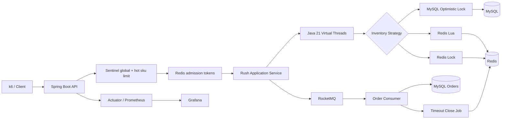

# TicketRush

Java 21 + Spring Boot 3 高并发票务秒杀系统，用于演示景区、剧院、演出、年卡等票务场景中的抢票、防超卖、限流、异步削峰、最终一致性、压测、监控和部署闭环。

TicketRush 不是一个 CRUD 示例，而是一个围绕真实高并发票务链路设计的后端作品项目。主链路从抢票入口开始，经过 Sentinel 限流、Redis 准入令牌、Virtual Threads 库存预占、Redis/MySQL 多策略防超卖、RocketMQ 异步下单、订单幂等、超时关闭补偿，最终落到 Prometheus/Grafana 可观测和 Docker/K3s 部署。

## GitHub 展示入口

如果你是第一次打开这个仓库，建议先按这个顺序看：

1. 本页的“项目亮点”“架构图”“核心链路”“快速启动”“验证状态”。
2. [docs/github-showcase.md](docs/github-showcase.md)：快速展示摘要、推荐浏览顺序、项目摘要和边界说明。
3. [docs/demo-runbook.md](docs/demo-runbook.md)：5 分钟演示路径、CLI 替代演示和设计取舍。
4. [docs/rush-benchmark-report.md](docs/rush-benchmark-report.md) 与 [docs/executor-benchmark-report.md](docs/executor-benchmark-report.md)：压测和 Virtual Threads 证据。

展示边界：TicketRush 是本地可运行、可压测、可解释的 Java 21 高并发票务作品项目；Demo Console 不是完整后台管理系统，真实支付、短信、实名制、多租户 SaaS 和生产订单系统不在当前范围。
## 项目亮点

- **Java 21 Virtual Threads 实战**：抢票库存预占和执行器基准接口都走虚拟线程，响应中可看到 `processedByVirtualThread=true`。
- **三种防超卖策略对比**：Redis Lua、Redis 分布式锁、MySQL 乐观锁共用同一抢票入口，便于压测横向比较。
- **入口稳定性治理**：Sentinel 全局 QPS、热点票档参数限流、Redis 准入令牌三层保护，限流统一返回 `C0429`。
- **RocketMQ 异步削峰**：抢票成功后发布订单创建消息，消费者幂等创建 `PENDING` 订单，入口失败时回滚预占库存。
- **最终一致性补偿**：订单超时关闭任务批量关闭过期订单，并释放锁定库存。
- **可观测和部署闭环**：Actuator + Prometheus + Grafana，Docker Compose 一键启动，Kubernetes/K3s 清单可演示。
- **技术说明文档**：架构图、数据库 schema、稳定性治理、Arthas 诊断、踩坑记录和压测脚本都已落地。

## 技术栈

| 分类 | 技术 |
| --- | --- |
| Runtime | Java 21, Virtual Threads, Spring Boot 3.2.4 |
| Cloud | Spring Cloud 2023, Spring Cloud Alibaba, Nacos, Sentinel, RocketMQ, Seata |
| Storage | MySQL 8.4, Redis 7.2, Elasticsearch 8.13 |
| Persistence | MyBatis, XML Mapper, SQL schema |
| Concurrency | Redis Lua, Redis distributed lock, MySQL optimistic lock |
| Observability | Spring Boot Actuator, Micrometer, Prometheus, Grafana, Arthas |
| Delivery | Docker Compose, Dockerfile, Kubernetes/K3s manifests |
| Test & Benchmark | JUnit 5, Spring Cloud Stream test binder, k6 |

说明：Seata 依赖、配置与 MySQL AT 示例已落地，当前高并发主链路仍优先采用 Redis/RocketMQ 最终一致性补偿；Elasticsearch 已作为活动/票档查询读模型接入，不参与抢票写链路。

## 架构图



更完整的总体架构、抢票主链路、补偿链路和部署视图见 [docs/architecture.md](./docs/architecture.md)。

## 核心链路

```text
POST /api/rush/tickets
  -> request validation
  -> Sentinel global and hot-sku guard
  -> Redis admission token
  -> Virtual Thread inventory reservation
  -> Redis Lua / Redis Lock / MySQL optimistic lock
  -> RocketMQ OrderCreateMessage
  -> orderCreateConsumer
  -> PENDING order
  -> timeout close job releases locked stock
```

## 功能清单

### 抢票与库存

- 抢票入口：`POST /api/rush/tickets`。
- 本地库存预热：`POST /api/rush/inventory/preload`。
- 库存守恒模型：`totalStock = availableStock + lockedStock + soldStock`。
- Redis Hash 库存结构：`ticketrush:inventory:{skuId}`。
- Redis Lua 原子预占：库存检查、库存预占、版本递增、幂等 Key 写入。
- Redis 分布式锁：票档粒度 `SET NX` 锁保护库存 Hash 读写。
- MySQL 乐观锁：`version` + `available_stock >= quantity` 条件更新。

### 异步削峰与一致性

- 抢票成功后发布 `OrderCreateMessage`。
- RocketMQ 消费者幂等创建订单。
- 重复消息不会重复落单。
- 消息发送失败时释放已预占库存。
- 订单超时关闭任务释放锁定库存。
- 最终一致性设计见 [docs/final-consistency.md](./docs/final-consistency.md)。
- Seata AT 示例见 [docs/seata-transaction-demo.md](./docs/seata-transaction-demo.md)，用于演示 MySQL 库存预占和订单落库的同步全局事务。

### Elasticsearch 查询

- MySQL 仍是活动和票档写模型，Elasticsearch 保存 `(eventId, skuId)` 聚合读模型。
- `POST /api/search/events/{eventId}/index` 按活动重建票档搜索文档。
- `GET /api/search/ticket-skus` 支持按关键字、活动 ID、活动状态和票档状态查询。
- 详细说明见 [docs/elasticsearch-search.md](./docs/elasticsearch-search.md)。

### 本地演示控制台

- `http://localhost:8080/` 提供轻量 Demo Console，用于串联健康检查、库存预热、抢票、Elasticsearch 查询和执行器 benchmark。
- 控制台只调用现有 API，不引入登录、后台管理、支付或订单管理页面。

### 稳定性治理

- Sentinel 全局抢票资源：`ticketrush:rush:ticket`。
- Sentinel 热点票档资源：`ticketrush:rush:ticket:sku`。
- Redis 准入令牌按票档限制同时进入库存扣减链路的请求数。
- 热点库存可通过配置在启动时自动预热。
- 稳定性治理说明见 [docs/stability-governance.md](./docs/stability-governance.md)。

### 压测与诊断

- 抢票压测脚本：[scripts/k6/rush-ticket.js](./scripts/k6/rush-ticket.js)。
- 本地压测报告：[docs/rush-benchmark-report.md](./docs/rush-benchmark-report.md)。
- Virtual Threads 执行器基准报告：[docs/executor-benchmark-report.md](./docs/executor-benchmark-report.md)。
- 稳定性治理 before/after 报告：[docs/governance-comparison-report.md](./docs/governance-comparison-report.md)。
- 热点票档分摊压测报告：[docs/hotspot-spread-benchmark-report.md](./docs/hotspot-spread-benchmark-report.md)。
- Prometheus/Grafana 指标证据报告：[docs/observability-benchmark-report.md](./docs/observability-benchmark-report.md)。
- Seata 分布式事务示例：[docs/seata-transaction-demo.md](./docs/seata-transaction-demo.md)。
- Elasticsearch 活动/票档查询：[docs/elasticsearch-search.md](./docs/elasticsearch-search.md)。
- 稳定性治理压测脚本：[scripts/k6/stability-governance.js](./scripts/k6/stability-governance.js)。
- Sentinel Dashboard 动态规则样例：[docs/sentinel-dashboard-demo.md](./docs/sentinel-dashboard-demo.md)。
- Arthas 抢票链路诊断案例：[docs/arthas-diagnostics.md](./docs/arthas-diagnostics.md)。

## 快速启动

### 基础要求

- JDK 21。
- Maven 3.9+。
- Docker Desktop 或兼容 Docker Compose 的本地环境。

项目启用了 Java 21 版本门禁和 `--enable-preview` 编译参数，请使用 JDK 21 构建。

### 构建应用 JAR

```bash
mvn clean package -DskipTests
```

如果要完整验证：

```bash
mvn clean verify
```

### 启动全链路环境

```bash
docker compose up -d
```

默认会启动应用和核心中间件：MySQL、Redis、Nacos、RocketMQ、Seata、Elasticsearch、Prometheus、Grafana。

如果要同时启动 Sentinel Dashboard：

```bash
docker compose --profile sentinel up -d
```

服务入口：

| 服务 | 地址 |
| --- | --- |
| TicketRush Demo Console | http://localhost:8080/ |
| Health | http://localhost:8080/api/system/health |
| Actuator Health | http://localhost:8080/actuator/health |
| Prometheus | http://localhost:9090 |
| Grafana | http://localhost:3000 |
| Nacos | http://localhost:8848 |
| Sentinel Dashboard | http://localhost:8858 |
| Elasticsearch | http://localhost:9200 |

端口冲突时，MySQL 可用环境变量覆盖：

```bash
TICKETRUSH_MYSQL_PORT=13306 docker compose up -d
```

### 手动验证抢票

预热库存：

```bash
curl -X POST http://localhost:8080/api/rush/inventory/preload \
  -H "Content-Type: application/json" \
  -d '{"skuId":1001,"totalStock":1000}'
```

发起抢票：

```bash
curl -X POST http://localhost:8080/api/rush/tickets \
  -H "Content-Type: application/json" \
  -d '{
    "requestId":"req-001",
    "userId":2001,
    "eventId":3001,
    "skuId":1001,
    "quantity":1,
    "strategy":"REDIS_LUA",
    "idempotentKey":"rush:demo:2001:1001:req-001"
  }'
```

响应中重点看：

```json
{
  "accepted": true,
  "remainingStock": 999,
  "processedByVirtualThread": true
}
```

## 压测入口

三种库存策略压测：

```powershell
k6 run `
  -e BASE_URL=http://localhost:8080 `
  -e STRATEGY=REDIS_LUA `
  -e VUS=200 `
  -e DURATION=60s `
  -e STOCK=100000 `
  scripts/k6/rush-ticket.js
```

`STRATEGY` 可选：

| 策略 | 用途 |
| --- | --- |
| `REDIS_LUA` | 主推荐方案，验证 Redis 单线程 Lua 原子扣减 |
| `REDIS_LOCK` | 对比锁竞争下的吞吐和延迟 |
| `MYSQL_OPTIMISTIC_LOCK` | 对比数据库热点行写冲突 |

稳定性治理压测：

```powershell
k6 run `
  -e BASE_URL=http://localhost:8080 `
  -e SCENARIO_TAG=governed `
  -e SKU_SPREAD=1 `
  -e VUS=500 `
  -e DURATION=60s `
  scripts/k6/stability-governance.js
```

记录模板见 [docs/stability-benchmark.md](./docs/stability-benchmark.md)。

## API 概览

| 方法 | 路径 | 说明 |
| --- | --- | --- |
| `GET` | `/api/system/health` | 应用名、Java 版本、虚拟线程开关和当前线程类型 |
| `POST` | `/api/system/validation-check` | 参数校验和统一响应格式示例 |
| `POST` | `/api/rush/inventory/preload` | 本地压测前预热票档库存 |
| `POST` | `/api/rush/tickets` | 抢票入口，支持三种库存扣减策略 |
| `POST` | `/api/benchmark/executors` | Virtual Threads 与传统线程池执行器对比 |
| `POST` | `/api/search/events/{eventId}/index` | 按活动重建 Elasticsearch 票档搜索文档 |
| `GET` | `/api/search/ticket-skus` | 查询 Elasticsearch 活动/票档读模型 |
| `GET` | `/actuator/prometheus` | Prometheus 指标抓取入口 |
| `GET` | `/` | 本地演示控制台静态页 |

常见业务错误码：

| 错误码 | 含义 |
| --- | --- |
| `A0429` | 重复请求 |
| `B0401` | 库存不足 |
| `B0402` | 库存未预热、锁竞争失败、版本冲突或扣减失败 |
| `C0429` | Sentinel 或 Redis 准入令牌限流 |
| `C0503` | 库存预占超时、消息发送失败或服务繁忙 |

## 验证状态

当前已验证：

- `mvn test`：52 tests，0 failures，0 errors。
- Docker Compose 全链路启动：应用 + 9 个核心中间件容器。
- `/api/system/health`：`UP`，Java 21，虚拟线程开关开启。
- `/`：本地 Demo Console 可访问，页面串联健康检查、库存预热、抢票、检索和执行器 benchmark。
- `/api/rush/inventory/preload`：库存预热成功。
- `/api/rush/tickets`：抢票成功，返回 `processedByVirtualThread=true`。
- `/actuator/prometheus`：指标正常输出。
- Dockerized k6 本地压测：三种库存策略低负载 baseline 和单热点票档默认治理观察已完成。
- Virtual Threads vs 传统线程池执行器 benchmark：纯 I/O 等待场景虚拟线程吞吐约为传统固定线程池的 22.55 倍。
- 稳定性治理 before/after：默认治理开启时单热点流量 86.25% 被限流，关闭治理后几乎全部进入核心链路。
- 热点票档分摊对比：`SKU_SPREAD=1` 时 87.56% 被限流，`SKU_SPREAD=20` 时本轮 0 次 `C0429`，受理数提升到 7,496。
- Prometheus/Grafana 指标证据：单热点压测下 Prometheus RPS 峰值 828.63/s，HTTP p95 约 3.1ms，CPU 峰值约 2.15%。
- Seata AT 示例：MySQL 库存预占和订单落库被 `@GlobalTransactional` 包裹，并有单元测试覆盖事务注解、幂等和失败回滚边界。
- Elasticsearch 查询：活动/票档读模型、索引重建 API、查询 API 和查询 JSON 构建均有单元测试覆盖。
- Redis Lua、Redis Lock、MySQL optimistic lock、RocketMQ Stream binder、MyBatis XML/schema 均有测试覆盖。

未完成或待补强：

- Elasticsearch 运行态 smoke 需要 Docker Compose 中已有 MySQL 活动/票档数据后再执行。

## 项目结构

```text
src/main/java/com/ticketrush
├── common          # 统一响应、错误码、异常、ID
├── config          # Web、虚拟线程、Redis、MQ、Sentinel、Seata、监控配置
├── interfaces      # Controller、Request、Response
├── application     # 应用服务、用例编排、命令对象、DTO
├── domain          # 领域模型、领域服务、仓储接口
├── infrastructure  # MySQL、Redis、RocketMQ、Elasticsearch、Seata、Sentinel 适配
└── job             # 热点库存预热、订单超时关闭、补偿任务
```

## 设计说明

项目概览：

```text
TicketRush 是我做的 Java 21 高并发票务秒杀系统，场景来自景区和演出票务抢票。它的主链路覆盖 Sentinel 限流、Redis 准入令牌、Virtual Threads 库存预占、Redis Lua/Redis Lock/MySQL 乐观锁三种防超卖策略、RocketMQ 异步下单、消费幂等、订单超时关闭补偿，以及 Prometheus/Grafana 监控和 Docker/K3s 部署。这个项目用来证明我能把高并发票务里的防超卖、削峰、幂等、一致性和可观测做成可运行、可压测、可解释的工程闭环。
```

设计取舍：

- 为什么 Redis Lua 是热点票档库存扣减的主推荐方案？
- Redis 分布式锁和 MySQL 乐观锁在高并发下分别会暴露什么瓶颈？
- Virtual Threads 适合抢票链路中的哪些 IO 密集环节，不适合解决什么问题？
- Sentinel 热点参数限流和 Redis 准入令牌为什么要组合使用？
- RocketMQ 异步下单后，如何保证消息重复、发送失败和订单超时场景下的最终一致性？
- 如何用 k6、Prometheus、Grafana 和 Arthas 证明系统行为，而不是只讲架构图？

## 文档导航

| 文档 | 说明 |
| --- | --- |
| [SPEC.md](./SPEC.md) | 项目执行规格、阶段计划和当前进度 |
| [HANDOFF.md](./HANDOFF.md) | 当前接管状态和最近验证记录 |
| [PROJECT.md](./PROJECT.md) | 项目定位、质量标准和协作规则 |
| [docs/demo-runbook.md](./docs/demo-runbook.md) | 演示 Runbook、设计取舍和替代路径 |
| [docs/github-showcase.md](./docs/github-showcase.md) | GitHub 展示摘要、浏览顺序和项目摘要 |
| [docs/architecture.md](./docs/architecture.md) | 架构图、主链路、补偿链路和部署视图 |
| [docs/database-schema.md](./docs/database-schema.md) | MySQL schema、表结构、索引和乐观锁 SQL |
| [docs/executor-benchmark-report.md](./docs/executor-benchmark-report.md) | Virtual Threads 执行器基准报告 |
| [docs/final-consistency.md](./docs/final-consistency.md) | 异步下单、消费幂等和补偿策略 |
| [docs/elasticsearch-search.md](./docs/elasticsearch-search.md) | Elasticsearch 活动/票档查询读模型 |
| [docs/governance-comparison-report.md](./docs/governance-comparison-report.md) | 稳定性治理 before/after 对照报告 |
| [docs/hotspot-spread-benchmark-report.md](./docs/hotspot-spread-benchmark-report.md) | 单热点与多票档分摊压测报告 |
| [docs/observability-benchmark-report.md](./docs/observability-benchmark-report.md) | Prometheus/Grafana 压测指标证据 |
| [docs/rush-benchmark-report.md](./docs/rush-benchmark-report.md) | k6 本地压测报告 |
| [docs/seata-transaction-demo.md](./docs/seata-transaction-demo.md) | Seata AT 分布式事务示例 |
| [docs/stability-governance.md](./docs/stability-governance.md) | Sentinel、热点参数、Redis 准入令牌 |
| [docs/stability-benchmark.md](./docs/stability-benchmark.md) | 稳定性压测记录 |
| [docs/sentinel-dashboard-demo.md](./docs/sentinel-dashboard-demo.md) | Sentinel Dashboard 动态规则演示 |
| [docs/observability.md](./docs/observability.md) | Prometheus/Grafana 配置说明 |
| [docs/arthas-diagnostics.md](./docs/arthas-diagnostics.md) | Arthas 抢票链路诊断案例 |
| [docs/pitfalls.md](./docs/pitfalls.md) | JDK、k6、端口、Grafana、K8s 踩坑记录 |
| [deploy/k8s/README.md](./deploy/k8s/README.md) | Kubernetes/K3s 部署说明 |

推荐阅读路径：

```text
README -> SPEC -> architecture -> database-schema -> stability-governance -> final-consistency -> observability -> pitfalls
```

## 安全说明

- 不提交 `.env`、真实账号、token、cookie、私钥或本地运行数据。
- `docker/rocketmq/store/` 是本地 RocketMQ 运行数据目录，已加入 `.gitignore`。
- `deploy/k8s/secret.yaml` 只保留 `CHANGE_ME_*` 占位值，真实数据库凭据应在本地或集群 Secret 中替换。
- Docker Compose 中的数据库账号密码只用于本地演示环境，不用于生产。
