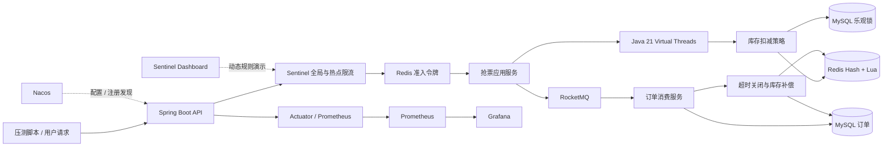
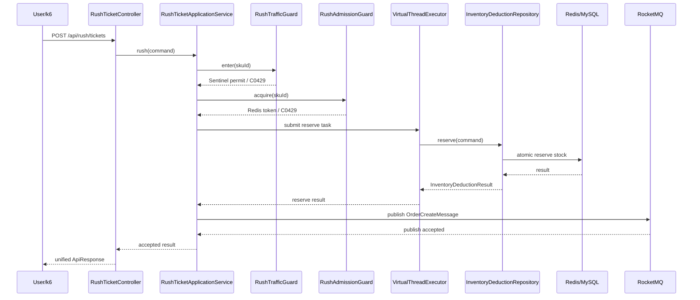
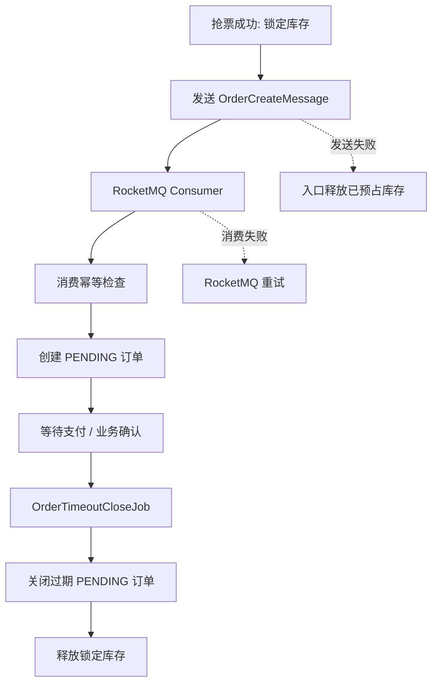
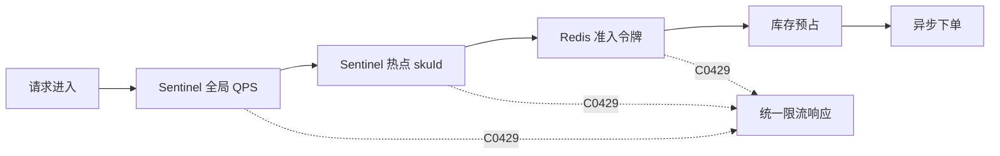
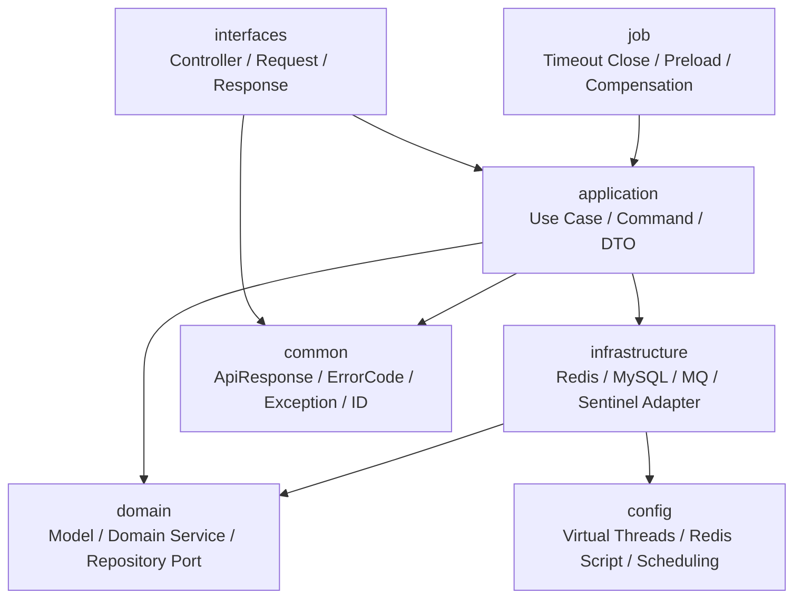
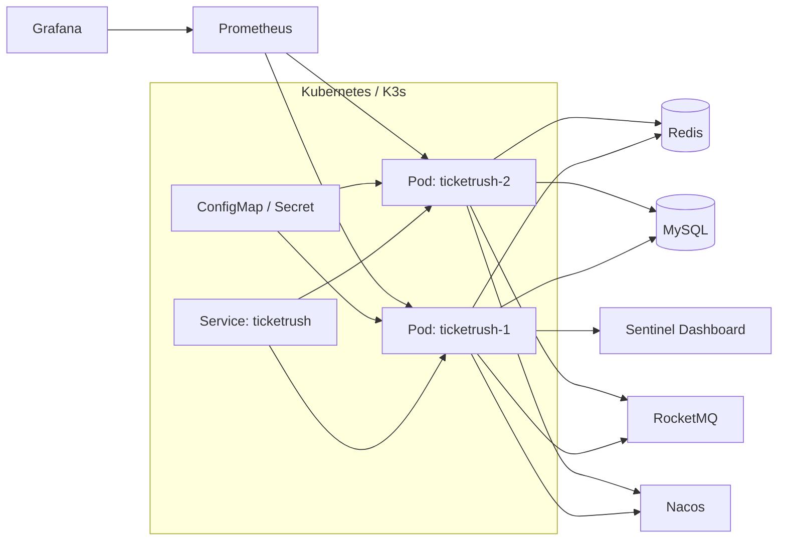

# TicketRush 架构说明

## 总体架构

## 抢票主链路

## 异步下单与补偿

## 稳定性治理顺序

## 分层结构

## 部署视图

## 设计取舍

- 抢票入口优先返回“已受理”，订单创建交给 RocketMQ 异步削峰。
- 库存扣减提供 Redis Lua、Redis 锁、MySQL 乐观锁三条路径，便于压测对比。
- Sentinel 负责流量入口保护，Redis 准入令牌负责限制进入核心库存链路的并发。
- 订单超时关闭负责释放锁定库存，作为最终一致性补偿路径。
- Prometheus/Grafana 负责趋势观测，Arthas 负责现场链路诊断。
